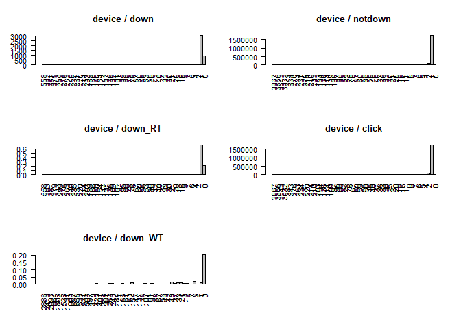

Ad Tracking
================

===================================================
---------------------------------------------------

(1) 필요한 데이타 불러오기
--------------------------

===================================================
---------------------------------------------------

``` r
source("ad_init.r")
source("ad_function.r")

df = readFile(paste0(path, path_file))
```

``` r
ad_df = df
head(ad_df, 20)
```

    ##        ip app device os channel          click_time attributed_time
    ## 1   83230   3      1 13     379 2017-11-06 14:32:21            <NA>
    ## 2    5323  64      1 13     459 2017-11-06 15:40:56            <NA>
    ## 3   42102   3      1 13     379 2017-11-06 15:45:45            <NA>
    ## 4  179519   3      1 20     379 2017-11-06 15:50:26            <NA>
    ## 5   12955   3      1 13     379 2017-11-06 15:56:12            <NA>
    ## 6   88537   9      1 13     442 2017-11-06 16:00:00            <NA>
    ## 7   21354  14      1 13     480 2017-11-06 16:00:00            <NA>
    ## 8  104366   9      1 16     215 2017-11-06 16:00:00            <NA>
    ## 9  171396  15      1  9     245 2017-11-06 16:00:01            <NA>
    ## 10 209663   2      1 17     469 2017-11-06 16:00:01            <NA>
    ## 11  81837   3      1 19     489 2017-11-06 16:00:01            <NA>
    ## 12 103698   3      1 13      19 2017-11-06 16:00:01            <NA>
    ## 13  92673   3      1 19     205 2017-11-06 16:00:01            <NA>
    ## 14 105782   2      1 15     364 2017-11-06 16:00:01            <NA>
    ## 15  18124   6      1 19     459 2017-11-06 16:00:01            <NA>
    ## 16 118393   9      1 13     244 2017-11-06 16:00:02            <NA>
    ## 17 179520  64      1 17     459 2017-11-06 16:00:02            <NA>
    ## 18   6853  13      1 14     477 2017-11-06 16:00:02            <NA>
    ## 19   5200  15      1 19     140 2017-11-06 16:00:02            <NA>
    ## 20  37586   3      1 13     137 2017-11-06 16:00:02            <NA>
    ##    is_attributed
    ## 1              0
    ## 2              0
    ## 3              0
    ## 4              0
    ## 5              0
    ## 6              0
    ## 7              0
    ## 8              0
    ## 9              0
    ## 10             0
    ## 11             0
    ## 12             0
    ## 13             0
    ## 14             0
    ## 15             0
    ## 16             0
    ## 17             0
    ## 18             0
    ## 19             0
    ## 20             0

``` r
dim(ad_df)
```

    ## [1] 1849039       8

===================================================
---------------------------------------------------

(2) cl\_h, cl\_d, cl\_dh 파생변수 만들기
----------------------------------------

===================================================
---------------------------------------------------

cl\_h : clickTime Hour
----------------------

cl\_d : clickTime Day
---------------------

cl\_dh : cl\_h + cl\_d
----------------------

``` r
tmp_date = re_dateVal(ad_df$click_time)
ad_df = cbind(ad_df, tmp_date)
rm(tmp_date)
head(ad_df, 20)
```

    ##        ip app device os channel          click_time attributed_time
    ## 1   83230   3      1 13     379 2017-11-06 14:32:21            <NA>
    ## 2    5323  64      1 13     459 2017-11-06 15:40:56            <NA>
    ## 3   42102   3      1 13     379 2017-11-06 15:45:45            <NA>
    ## 4  179519   3      1 20     379 2017-11-06 15:50:26            <NA>
    ## 5   12955   3      1 13     379 2017-11-06 15:56:12            <NA>
    ## 6   88537   9      1 13     442 2017-11-06 16:00:00            <NA>
    ## 7   21354  14      1 13     480 2017-11-06 16:00:00            <NA>
    ## 8  104366   9      1 16     215 2017-11-06 16:00:00            <NA>
    ## 9  171396  15      1  9     245 2017-11-06 16:00:01            <NA>
    ## 10 209663   2      1 17     469 2017-11-06 16:00:01            <NA>
    ## 11  81837   3      1 19     489 2017-11-06 16:00:01            <NA>
    ## 12 103698   3      1 13      19 2017-11-06 16:00:01            <NA>
    ## 13  92673   3      1 19     205 2017-11-06 16:00:01            <NA>
    ## 14 105782   2      1 15     364 2017-11-06 16:00:01            <NA>
    ## 15  18124   6      1 19     459 2017-11-06 16:00:01            <NA>
    ## 16 118393   9      1 13     244 2017-11-06 16:00:02            <NA>
    ## 17 179520  64      1 17     459 2017-11-06 16:00:02            <NA>
    ## 18   6853  13      1 14     477 2017-11-06 16:00:02            <NA>
    ## 19   5200  15      1 19     140 2017-11-06 16:00:02            <NA>
    ## 20  37586   3      1 13     137 2017-11-06 16:00:02            <NA>
    ##    is_attributed cl_d cl_h cl_dh
    ## 1              0    6   14   614
    ## 2              0    6   15   615
    ## 3              0    6   15   615
    ## 4              0    6   15   615
    ## 5              0    6   15   615
    ## 6              0    6   16   616
    ## 7              0    6   16   616
    ## 8              0    6   16   616
    ## 9              0    6   16   616
    ## 10             0    6   16   616
    ## 11             0    6   16   616
    ## 12             0    6   16   616
    ## 13             0    6   16   616
    ## 14             0    6   16   616
    ## 15             0    6   16   616
    ## 16             0    6   16   616
    ## 17             0    6   16   616
    ## 18             0    6   16   616
    ## 19             0    6   16   616
    ## 20             0    6   16   616

``` r
# f_name = paste0(path_newData, "newSample.csv")
# writeFile(ad_df, f_name)
```

===================================================
---------------------------------------------------

(3) 데이터 분석하기
-------------------

===================================================
---------------------------------------------------

01 :: App다운받은 데이터와 App다운받지 않은 데이터 나누기
---------------------------------------------------------

down\_df 광고를 보고 어플을 다운받음
------------------------------------

not\_df 광고만 보고 다운받지 않음
---------------------------------

ad\_df (down\_df + not\_df) DATA
--------------------------------

``` r
down_df = ad_df[ad_df$is_attributed == 1, ]
not_df = ad_df[ad_df$is_attributed == 0, ]

par(mfrow = c(1, 2))
head(down_df, 20)
```

    ##           ip app device os channel          click_time     attributed_time
    ## 261   116294  19      0 21     213 2017-11-06 16:00:32 2017-11-07 09:35:07
    ## 412     7593  19      0 24     213 2017-11-06 16:00:46 2017-11-07 15:48:18
    ## 991    62765  19      0 24     347 2017-11-06 16:01:47 2017-11-06 16:15:34
    ## 2220  132491  10      1  8     203 2017-11-06 16:04:18 2017-11-06 16:06:26
    ## 2336   69026  36      1 22     110 2017-11-06 16:04:32 2017-11-07 04:15:11
    ## 2386   32906   8      1 13     145 2017-11-06 16:04:38 2017-11-06 17:43:02
    ## 4702   99912  35      1 10      21 2017-11-06 16:09:19 2017-11-07 08:00:31
    ## 4965   22393  19      0  0     213 2017-11-06 16:09:55 2017-11-07 07:37:42
    ## 6555  163800  19   2886 76     213 2017-11-06 16:13:34 2017-11-07 02:06:50
    ## 7522   99221  18      1 19     134 2017-11-06 16:15:52 2017-11-07 07:42:52
    ## 8375  178259   1      1 22     135 2017-11-06 16:17:59 2017-11-07 02:42:09
    ## 8639  183574  34      1 12     243 2017-11-06 16:18:38 2017-11-06 16:20:10
    ## 9530  194103 250     33 29     101 2017-11-06 16:20:47 2017-11-06 16:26:20
    ## 11564 203995  18      1 37     107 2017-11-06 16:25:49 2017-11-07 11:39:17
    ## 11727 139654 265      0  0     101 2017-11-06 16:26:19 2017-11-06 16:51:22
    ## 11818 176685  29      1 13     213 2017-11-06 16:26:35 2017-11-06 16:28:06
    ## 11870 128419  19      0  0     213 2017-11-06 16:26:44 2017-11-06 16:28:12
    ## 13399 210294  29      1 19     333 2017-11-06 16:30:46 2017-11-06 16:52:18
    ## 13605  16681  19      0 24     347 2017-11-06 16:31:19 2017-11-06 23:25:17
    ## 13706 193839  19    235  0     213 2017-11-06 16:31:36 2017-11-07 06:58:33
    ##       is_attributed cl_d cl_h cl_dh
    ## 261               1    6   16   616
    ## 412               1    6   16   616
    ## 991               1    6   16   616
    ## 2220              1    6   16   616
    ## 2336              1    6   16   616
    ## 2386              1    6   16   616
    ## 4702              1    6   16   616
    ## 4965              1    6   16   616
    ## 6555              1    6   16   616
    ## 7522              1    6   16   616
    ## 8375              1    6   16   616
    ## 8639              1    6   16   616
    ## 9530              1    6   16   616
    ## 11564             1    6   16   616
    ## 11727             1    6   16   616
    ## 11818             1    6   16   616
    ## 11870             1    6   16   616
    ## 13399             1    6   16   616
    ## 13605             1    6   16   616
    ## 13706             1    6   16   616

``` r
head(not_df, 20)
```

    ##        ip app device os channel          click_time attributed_time
    ## 1   83230   3      1 13     379 2017-11-06 14:32:21            <NA>
    ## 2    5323  64      1 13     459 2017-11-06 15:40:56            <NA>
    ## 3   42102   3      1 13     379 2017-11-06 15:45:45            <NA>
    ## 4  179519   3      1 20     379 2017-11-06 15:50:26            <NA>
    ## 5   12955   3      1 13     379 2017-11-06 15:56:12            <NA>
    ## 6   88537   9      1 13     442 2017-11-06 16:00:00            <NA>
    ## 7   21354  14      1 13     480 2017-11-06 16:00:00            <NA>
    ## 8  104366   9      1 16     215 2017-11-06 16:00:00            <NA>
    ## 9  171396  15      1  9     245 2017-11-06 16:00:01            <NA>
    ## 10 209663   2      1 17     469 2017-11-06 16:00:01            <NA>
    ## 11  81837   3      1 19     489 2017-11-06 16:00:01            <NA>
    ## 12 103698   3      1 13      19 2017-11-06 16:00:01            <NA>
    ## 13  92673   3      1 19     205 2017-11-06 16:00:01            <NA>
    ## 14 105782   2      1 15     364 2017-11-06 16:00:01            <NA>
    ## 15  18124   6      1 19     459 2017-11-06 16:00:01            <NA>
    ## 16 118393   9      1 13     244 2017-11-06 16:00:02            <NA>
    ## 17 179520  64      1 17     459 2017-11-06 16:00:02            <NA>
    ## 18   6853  13      1 14     477 2017-11-06 16:00:02            <NA>
    ## 19   5200  15      1 19     140 2017-11-06 16:00:02            <NA>
    ## 20  37586   3      1 13     137 2017-11-06 16:00:02            <NA>
    ##    is_attributed cl_d cl_h cl_dh
    ## 1              0    6   14   614
    ## 2              0    6   15   615
    ## 3              0    6   15   615
    ## 4              0    6   15   615
    ## 5              0    6   15   615
    ## 6              0    6   16   616
    ## 7              0    6   16   616
    ## 8              0    6   16   616
    ## 9              0    6   16   616
    ## 10             0    6   16   616
    ## 11             0    6   16   616
    ## 12             0    6   16   616
    ## 13             0    6   16   616
    ## 14             0    6   16   616
    ## 15             0    6   16   616
    ## 16             0    6   16   616
    ## 17             0    6   16   616
    ## 18             0    6   16   616
    ## 19             0    6   16   616
    ## 20             0    6   16   616

02 :: down\_df와 not\_df내에서의 변수 별 빈도수 알아보기
--------------------------------------------------------

``` r
#"ip","app","device","os","channel","cl_d","cl_h","cl_dh"  
search = 'app'
result = attributed_(down_df, not_df, ad_df, search)
drawBarplot(result, search, TRUE)
rm(result)
```


``` r
search = 'device'
result = attributed_(down_df, not_df, ad_df, search)
drawBarplot(result, search, TRUE)
rm(result)
```



``` r
search = 'os'
result = attributed_(down_df, not_df, ad_df, search)
drawBarplot(result, search, TRUE)
rm(result)
```


``` r
search = 'channel'
result = attributed_(down_df, not_df, ad_df, search)
drawBarplot(result, search, TRUE)
rm(result)
```


``` r
search = 'cl_d'
result = attributed_(down_df, not_df, ad_df, search)
drawBarplot(result, search, FALSE)
rm(result)
```


``` r
search = 'cl_h'
result = attributed_(down_df, not_df, ad_df, search)
drawBarplot(result, search, FALSE)
rm(result)
```


