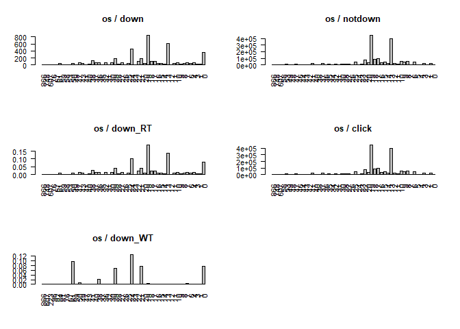
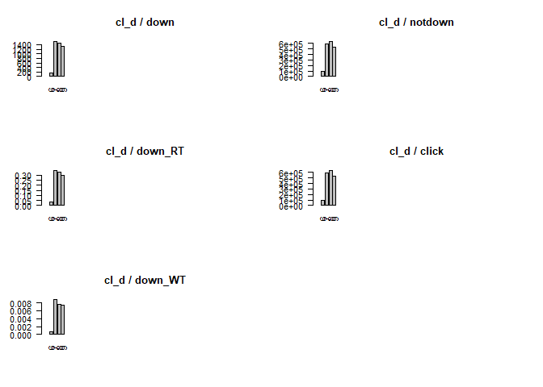

AdTracking
================

(1) 필요한 데이타 불러오기
==========================

=======================================
=======================================

``` r
source("ad_init.r")
```

    ## Warning: package 'stringr' was built under R version 3.4.3

``` r
source("ad_function.r")

df = readFile(paste0(path, path_file))
```

``` r
ad_df = df
head(ad_df, 10)
```

    ##        ip app device os channel          click_time attributed_time
    ## 1   83230   3      1 13     379 2017-11-06 14:32:21            <NA>
    ## 2    5323  64      1 13     459 2017-11-06 15:40:56            <NA>
    ## 3   42102   3      1 13     379 2017-11-06 15:45:45            <NA>
    ## 4  179519   3      1 20     379 2017-11-06 15:50:26            <NA>
    ## 5   12955   3      1 13     379 2017-11-06 15:56:12            <NA>
    ## 6   88537   9      1 13     442 2017-11-06 16:00:00            <NA>
    ## 7   21354  14      1 13     480 2017-11-06 16:00:00            <NA>
    ## 8  104366   9      1 16     215 2017-11-06 16:00:00            <NA>
    ## 9  171396  15      1  9     245 2017-11-06 16:00:01            <NA>
    ## 10 209663   2      1 17     469 2017-11-06 16:00:01            <NA>
    ##    is_attributed
    ## 1              0
    ## 2              0
    ## 3              0
    ## 4              0
    ## 5              0
    ## 6              0
    ## 7              0
    ## 8              0
    ## 9              0
    ## 10             0

``` r
dim(ad_df)
```

    ## [1] 1849039       8

(2) cl\_h, cl\_d, cl\_dh 파생변수 만들기
========================================

=======================================
=======================================
<p style="font-weight:bold;">
cl\_h : clickTime Hour<br /> cl\_d : clickTime Day<br /> cl\_dh : cl\_h + cl\_d<br />
</p>

``` r
tmp_date = re_dateVal(ad_df$click_time)
ad_df = cbind(ad_df, tmp_date)
rm(tmp_date)
head(ad_df, 10)
```

    ##        ip app device os channel          click_time attributed_time
    ## 1   83230   3      1 13     379 2017-11-06 14:32:21            <NA>
    ## 2    5323  64      1 13     459 2017-11-06 15:40:56            <NA>
    ## 3   42102   3      1 13     379 2017-11-06 15:45:45            <NA>
    ## 4  179519   3      1 20     379 2017-11-06 15:50:26            <NA>
    ## 5   12955   3      1 13     379 2017-11-06 15:56:12            <NA>
    ## 6   88537   9      1 13     442 2017-11-06 16:00:00            <NA>
    ## 7   21354  14      1 13     480 2017-11-06 16:00:00            <NA>
    ## 8  104366   9      1 16     215 2017-11-06 16:00:00            <NA>
    ## 9  171396  15      1  9     245 2017-11-06 16:00:01            <NA>
    ## 10 209663   2      1 17     469 2017-11-06 16:00:01            <NA>
    ##    is_attributed cl_d cl_h cl_dh
    ## 1              0    6   14   614
    ## 2              0    6   15   615
    ## 3              0    6   15   615
    ## 4              0    6   15   615
    ## 5              0    6   15   615
    ## 6              0    6   16   616
    ## 7              0    6   16   616
    ## 8              0    6   16   616
    ## 9              0    6   16   616
    ## 10             0    6   16   616

``` r
# f_name = paste0(path_newData, "newSample.csv")
# writeFile(ad_df, f_name)
```

(3) 데이터 분석하기
===================

=======================================
=======================================

<p style="font-weight:bold;font-size:25px;">
01 :: App다운받은 데이터와 App다운받지 않은 데이터 나누기<br/>
</p>
<p style="font-weight:bold;">
down\_df : 광고를 보고 어플을 다운받음<br/> not\_df : 광고만 보고 다운받지 않음<br/> ad\_df : 전체 데이터<br/>
</p>
=======================================
=======================================

``` r
down_df = ad_df[ad_df$is_attributed == 1, ]
not_df = ad_df[ad_df$is_attributed == 0, ]

head(down_df, 10)
```

    ##          ip app device os channel          click_time     attributed_time
    ## 261  116294  19      0 21     213 2017-11-06 16:00:32 2017-11-07 09:35:07
    ## 412    7593  19      0 24     213 2017-11-06 16:00:46 2017-11-07 15:48:18
    ## 991   62765  19      0 24     347 2017-11-06 16:01:47 2017-11-06 16:15:34
    ## 2220 132491  10      1  8     203 2017-11-06 16:04:18 2017-11-06 16:06:26
    ## 2336  69026  36      1 22     110 2017-11-06 16:04:32 2017-11-07 04:15:11
    ## 2386  32906   8      1 13     145 2017-11-06 16:04:38 2017-11-06 17:43:02
    ## 4702  99912  35      1 10      21 2017-11-06 16:09:19 2017-11-07 08:00:31
    ## 4965  22393  19      0  0     213 2017-11-06 16:09:55 2017-11-07 07:37:42
    ## 6555 163800  19   2886 76     213 2017-11-06 16:13:34 2017-11-07 02:06:50
    ## 7522  99221  18      1 19     134 2017-11-06 16:15:52 2017-11-07 07:42:52
    ##      is_attributed cl_d cl_h cl_dh
    ## 261              1    6   16   616
    ## 412              1    6   16   616
    ## 991              1    6   16   616
    ## 2220             1    6   16   616
    ## 2336             1    6   16   616
    ## 2386             1    6   16   616
    ## 4702             1    6   16   616
    ## 4965             1    6   16   616
    ## 6555             1    6   16   616
    ## 7522             1    6   16   616

=======================================
=======================================

<p style="font-weight:bold;font-size:25px;">
02 :: down\_df와 not\_df내에서의 변수 별 빈도수 알아보기
</p>
=======================================
=======================================

``` r
#"ip","app","device","os","channel","cl_d","cl_h","cl_dh"  
search = 'app'
result = attributed_(down_df, not_df, ad_df, search)
drawBarplot(result, search, TRUE)
rm(result)
```


``` r
search = 'device'
result = attributed_(down_df, not_df, ad_df, search)
drawBarplot(result, search, TRUE)
rm(result)
```


``` r
search = 'os'
result = attributed_(down_df, not_df, ad_df, search)
drawBarplot(result, search, TRUE)
rm(result)
```



``` r
search = 'channel'
result = attributed_(down_df, not_df, ad_df, search)
drawBarplot(result, search, TRUE)
rm(result)
```


``` r
search = 'cl_d'
result = attributed_(down_df, not_df, ad_df, search)
drawBarplot(result, search, FALSE)
rm(result)
```



``` r
search = 'cl_h'
result = attributed_(down_df, not_df, ad_df, search)
drawBarplot(result, search, FALSE)
rm(result)
```


